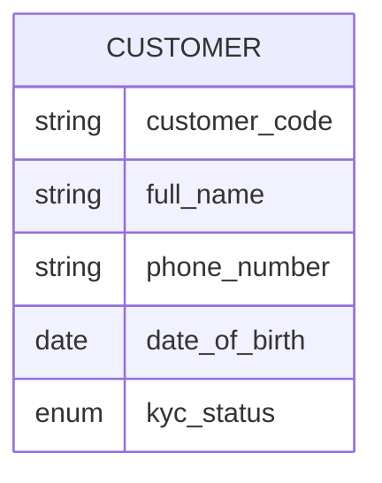

# BA Data Specification

Produce data specs that BAs use to document the data side of a feature, integration, or system at conceptual / business level. Output: Mermaid ER diagrams, entity description tables, data dictionaries, or data mappings — depending on variant.

## The BA boundary for data specs

**Cover (conceptual level):**
- Business entities (Customer, Order, Transaction — at concept level, not table level)
- Attributes in business terms (Customer name, not `customer_name VARCHAR(255)`)
- Relationships in business meaning (Customer **places** Order, with cardinality)
- Identifiers (what uniquely identifies an entity in business terms)
- Sensitivity classification (PII, financial, public)
- Ownership and stewardship (which team owns each entity / attribute)
- Lifecycle (when is data created, updated, archived, deleted — at business level)
- Mapping between systems (for integration: source entity → target entity, business transformation rules)

**Do NOT cover (handoff to dev / data engineer):**
- Physical schema (tables, columns, types, indexes)
- Constraints (NOT NULL, foreign keys, check constraints in DDL form)
- Database design choices (normalization level, denormalization, partitioning)
- Storage technology (Postgres vs MongoDB vs DynamoDB)
- Performance optimization (indexing, caching, materialized views)
- Migration scripts, DDL

**Acid test:** if a non-DBA business reader (product, finance, compliance) can read your output and understand what data exists and what it means, you're at the right level. If they need DBA knowledge to follow, you've drifted.

---

## Step 0 — Detect variant

| Variant | Signals | Output |
|---|---|---|
| **V-A — Conceptual data model (ERD)** | "mô hình dữ liệu cho feature X", "ERD", "entity model", "data model cho [feature]" | Mermaid ER + entity description table |
| **V-B — Data dictionary** | "data dictionary", "từ điển dữ liệu", "catalog dữ liệu", "document existing data fields" | Catalog table per entity, with business meaning, sensitivity, ownership |
| **V-C — Data mapping** | "data mapping", "ánh xạ dữ liệu", "mapping giữa hệ thống X và Y", "transformation rule" | Mapping table source → target with transformation rules |

Variants can compose (e.g., for integration: V-A on each side + V-C mapping). Default to V-A if unclear.

Record variant + rationale in metadata top.

---

## Workflow

### Step 1 — Read context

Universal minimum:
1. What's the scope of the data spec? (one feature, one module, one integration)
2. Variant-specific:
   - **V-A:** What feature / capability does this data support?
   - **V-B:** Which existing system / module are we cataloging?
   - **V-C:** Source system + target system; integration purpose

Variant-specific extra questions in `references/variants.md`.

Ask the fewest needed (max 3). Default + track for appendix.

**Critical prerequisites.** For V-C especially: if source/target system schemas aren't accessible (e.g., partner system without API docs), flag as critical — mapping is impossible without source-of-truth on the other side.

### Step 2 — Determine sections

**Universal:**
- Metadata (variant, scope, owner, status, date)
- Critical prerequisites (if any)
- Glossary (if ≥3 domain-specific terms)
- Variant-specific output (ERD / dictionary / mapping)
- Open questions
- Assumptions appendix

**V-A specific:**
- Entity overview (list)
- ER diagram (Mermaid)
- Entity description tables (one per entity)
- Relationship descriptions (in business prose for non-trivial relationships)

**V-B specific:**
- System / module being cataloged
- Entity-level catalog (one table per entity with attributes)
- Cross-entity glossary if ≥3 entities share concepts

**V-C specific:**
- Source system summary
- Target system summary
- Mapping table (per entity, then per attribute)
- Transformation rules (in business terms)
- Edge cases (what if source field is null, what if target enum doesn't have a matching value, etc.)

### Step 3 — Identify entities (V-A and V-B)

**For V-A (new feature):** brainstorm entities the feature involves. Use heuristic: noun-phrases in the feature description that have identity and lifecycle. "Customer" is an entity; "name" is an attribute of Customer, not an entity.

Common BA mistake: confusing **events** with **entities**. "Login" is not an entity; "Login Session" is.

**For V-B (existing system):** entities are what the system already has. Don't invent — observe.

For each entity, capture:
- Business name (canonical, in the user's language)
- 1-sentence business definition
- Identifier(s) — what uniquely identifies an instance at business level (often a code or natural key, not "ID")
- Owner — which team owns this entity (creates, decides on its data)
- Lifecycle — when created, when archived/deleted (business-level events, not DB CRUD)

### Step 4 — Define relationships (V-A)

For each pair of entities that interact, define:
- **Cardinality** — one-to-one, one-to-many, many-to-many
- **Business meaning** — verb-phrase ("Customer places Order", "Order contains Order Items")
- **Optionality** — is the relationship mandatory or optional in each direction?

**Mermaid ER notation:**
```
CUSTOMER ||--o{ ORDER : places
ORDER ||--|{ ORDER_ITEM : contains
```

Notation cheatsheet:
- `||` — exactly one (mandatory)
- `o|` — zero or one (optional, max one)
- `}|` — one or many (mandatory, can be many)
- `}o` — zero or many (optional, can be many)

Read left-to-right: `A ||--o{ B : verb` means "A relates to zero-or-many B by verb".

### Step 5 — Define attributes

For each entity, list attributes. Each attribute:
- **Name** (business name, in user's language)
- **Business meaning** (1 sentence)
- **Type** (business type, not technical: "Date", "Money amount in VND", "Phone number" — NOT "VARCHAR(15)")
- **Required** (yes/no at business level)
- **Sensitivity** (Public / Internal / Confidential / Restricted / PII / Financial)
- **Source** (where does the value come from — user input, system-generated, derived, external)
- **Notes** (constraints in business terms: "must be Vietnamese phone format", "between 0 and 100", "from picklist")

In Mermaid ER:


Keep attribute list focused — only business-meaningful attributes. Avoid system housekeeping fields (`created_at`, `updated_by`) unless they carry business meaning.

### Step 6 — Variant V-C: Build the mapping

**Mapping table structure:**

| Source entity | Source attribute | Target entity | Target attribute | Transformation rule | Direction | Edge case handling |
|---|---|---|---|---|---|---|

- **Transformation rule** in business terms: "trim whitespace", "map A→1, B→2", "concatenate first + last name", "lookup via reference table"
- **Direction** for two-way integrations: source→target, target→source, or both
- **Edge case handling** for: source field empty, source value not in target enum, length exceeds target field business limit, multi-value source vs single-value target

**For each pair of systems involved:**
- List entities on both sides
- For each target entity, identify source(s) — every target should have a source or be marked **derived**/**new**
- Identify orphan source attributes — fields in source that don't map anywhere; document why (out of scope, redundant, not needed)

**Edge case categories to think through:**
- Null / missing source — default value? skip? error?
- Source enum doesn't match target enum — closest mapping? fallback?
- Source has more precision than target (datetime with timezone → date) — truncate? floor?
- Source allows free text, target requires picklist — manual review? algorithmic match?
- Source is one-to-many, target is one-to-one (or vice versa) — aggregation rule?

### Step 7 — Document data dictionary entries (V-B)

For each entity, an entry with:
- **Header:** entity name, business definition, owner, source system, sensitivity classification of the entity overall
- **Attribute table:** name | business meaning | type (business) | required | sensitivity | source | notes
- **Lifecycle:** how this entity comes into existence, what events change it, when it's archived/deleted
- **Quality / freshness:** how up-to-date is this typically, known issues
- **Usage:** which reports/processes/decisions depend on this entity (this surfaces blast radius for changes)

### Step 8 — Self-check (rigor)

**Boundary rigor:**
- No physical types (VARCHAR, INT, BIGINT) — use business types
- No DDL syntax (NOT NULL, PRIMARY KEY constraints) — use business "required" yes/no
- No technology mentions (Postgres, MongoDB) unless user named them
- No performance hints (index, partition) — that's data engineering

**Content rigor (V-A):**
- Every entity has a business definition (not "stores X data" — what is X in business terms?)
- Every entity has at least one business identifier (not just "ID")
- Every relationship has cardinality AND a verb-phrase meaning
- Every relationship's optionality stated (mandatory both sides? optional one side?)
- Entities are nouns with identity, not events or actions

**Content rigor (V-B):**
- Every entity has an owner (named team / role)
- Sensitivity classification on every attribute
- Lifecycle stated (creation event, archival/deletion event)
- Usage section identifies downstream dependencies

**Content rigor (V-C):**
- Every target entity has source mapping (or marked **new** / **derived**)
- Every source entity used (or marked **orphan** with reason)
- Every mapping has transformation rule (even if "1:1, no transform")
- Edge cases addressed for: nulls, enum mismatches, precision differences, multiplicity mismatches
- Direction explicit (especially for bidirectional)

**Universal rigor:**
- Numbers (limits, lengths, precision) traceable to source or in appendix
- Critical prerequisites surfaced
- Glossary present if ≥3 domain terms

### Step 9 — Surface what's likely missing

Common omissions:
- **Audit / history** — does the entity have a version history? Who changed what when?
- **Soft delete vs hard delete** — when something is "deleted" in business terms, is it really gone or just hidden?
- **Multi-language / localization** — names in multiple languages? Reference data translated?
- **Reference data** — picklists, codes, lookup tables that change rarely but matter
- **Cross-entity invariants** — rules that span entities (e.g., "an Order's Customer must be active when Order is placed")
- **Time / period** — point-in-time entities (transactions) vs continuous (subscriptions, accounts)
- **Currency / unit** — if money: which currency? if measurement: which unit?

For V-C mapping:
- Reverse direction — if A→B is mapped, should B→A also be mapped (for sync-back)?
- Conflict resolution — if both sides modify, who wins?
- Initial load — does mapping work for backfill, or only steady state?

### Step 10 — Output

Default: Markdown in chat. ER diagrams render inline.

For file export: read `/mnt/skills/public/docx/SKILL.md` first. Entity tables transfer well to .docx. Mermaid ER renders as image if supported.

**Canonical output order:**
1. Document title + 1-line scope
2. Metadata (variant, variant rationale, scope, owner, status, date)
3. Critical prerequisites (if any)
4. Glossary (if applicable)
5. Variant-specific main content (ER diagram + tables / dictionary / mapping)
6. Open questions
7. Assumptions appendix

### Step 11 — Assumptions appendix

Same pattern. Group:
1. **Critical prerequisites** (flagged)
2. **Scope** — variant choice, entities included/excluded, attributes included
3. **Classification** — sensitivity classifications assumed when not explicit
4. **Cardinality** — relationship cardinalities chosen when ambiguous
5. **Transformation defaults (V-C)** — rules picked when multiple were sensible

---

## Compose with other BA skills

- **Feature spec referencing this data** → `ba-feature-spec`
- **Use case interacting with these entities** → `ba-use-case`
- **Test cases for data integrity / mapping correctness** → `ba-test-case`
- **Process flow showing data lifecycle** → `ba-process-model`

---

## Language handling

Vietnamese canonical:

| English | Vietnamese |
|---|---|
| Entity | Thực thể |
| Attribute | Thuộc tính |
| Relationship | Mối quan hệ |
| Cardinality | Lượng số quan hệ |
| Data dictionary | Từ điển dữ liệu |
| Data mapping | Ánh xạ dữ liệu |
| Sensitivity classification | Phân loại nhạy cảm |
| Owner / Steward | Chủ sở hữu / Người quản lý |
| Lifecycle | Vòng đời |

Inside Mermaid, use English (Mermaid ER label rules) but entity descriptions can be in Vietnamese.

---

## Common anti-patterns

- **Entity defined as a table** ("Customer table stores...") — entity is a business concept, table is implementation
- **Attribute with physical type** ("phone VARCHAR(15)") — use business type
- **Relationship without cardinality** ("Customer has Order") — must specify one-to-many vs many-to-many
- **Mystery attributes** (no business meaning, just name) — every attribute earns a 1-line definition
- **Mapping without transformation column** — even "1:1 direct" deserves to be stated explicitly
- **Mapping ignoring edge cases** — nulls / enum mismatches / precision are where bugs live
- **Confusing event with entity** — "Login" → entity should be "Login Session" or "Authentication Event"
- **No sensitivity classification** — every attribute should be classified

## See also

- `references/variants.md` — per-variant details (questions, pitfalls, blind spots)
- `references/examples.md` — annotated examples: good/bad ER, sample dictionary entry, sample mapping table, complete short V-A example
