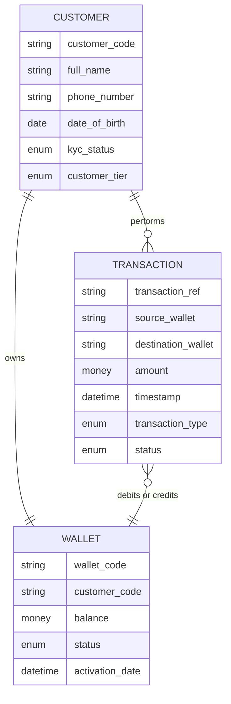

# Data Spec Examples

## Part 1 — ER diagram excerpts

### Bad: physical schema in ER

```
USERS_TBL {
  bigint id PK
  varchar(255) email NOT NULL UNIQUE
  varchar(60) password_hash NOT NULL
  timestamp created_at DEFAULT NOW()
  ...
}
```

Problems: DB table name suffix `_TBL`, primary key annotation, type lengths, NOT NULL constraints, DDL defaults. Pure DBA territory.

### Better: conceptual ER



Notes:
- Entity names singular, UPPERCASE convention
- Business types (money, datetime, enum, string) — not VARCHAR(N)
- No PK/FK syntax — relationships shown by lines
- Cardinality readable: customer → many transactions (mandatory side: customer); customer → exactly one wallet
- Transaction → wallet has many-to-one direction (a transaction always references one wallet on each side)

---

## Part 2 — Entity description table

| Field | Value |
|---|---|
| **Entity** | Customer (Khách hàng) |
| **Business definition** | A retail individual who has registered for and uses the platform. Distinct from corporate customers (separate entity). |
| **Business identifier** | `customer_code` — internal canonical ID; phone is a secondary natural key (unique per customer) |
| **Owner** | Customer Operations team |
| **Lifecycle** | Created upon successful KYC. Archived 12 months after account closure (per data retention policy). Hard-deleted only by Data Privacy team upon legal request. |
| **Sensitivity** | Confidential — contains PII (name, phone, DOB) |
| **Volume estimate** | ~1M existing, ~5K new per day |

**Attributes:**

| Name | Business meaning | Type | Required | Sensitivity | Source | Notes |
|---|---|---|---|---|---|---|
| customer_code | Internal canonical ID | string | yes | Internal | System-generated | Format: `CUS-` + 10-digit sequence |
| full_name | Customer's legal name as on ID document | string | yes | PII | User input + KYC | Must match KYC document |
| phone_number | Primary contact, also login identifier | string | yes | PII | User input | Vietnamese mobile format; unique per customer |
| date_of_birth | For age verification (18+ requirement) | date | yes | PII | User input + KYC | Must match KYC document |
| kyc_status | KYC verification state | enum | yes | Internal | System | Values: `pending`, `verified`, `rejected`, `expired` |
| customer_tier | Service tier for limits and benefits | enum | yes | Internal | System (derived) | Values: `basic`, `premium`, `vip` |

Notes: every attribute has business meaning, business type, sensitivity classification, and source.

---

## Part 3 — Data mapping example (V-C)

Context: Integration between our wallet platform and a partner merchant's payment system. We need to know payments coming in.

### Mapping table

| # | Source (partner) | Target (us) | Transformation | Direction | Edge case handling |
|---|---|---|---|---|---|
| M-01 | `merchant_id` (string, partner's internal) | `partner_code` (CUSTOMER entity) | Lookup via partner registry; map partner_id → our canonical partner_code | →| If not found in registry: reject transaction, alert ops |
| M-02 | `user_phone` (E.164 format, e.g., `+84901234567`) | `phone_number` (Vietnamese local format `0901234567`) | Strip `+84` country code, prepend `0` | →| If non-Vietnamese phone: reject; if format invalid: reject |
| M-03 | `txn_amount` (decimal, in cents) | `amount` (money, in VND) | Divide by 100 to convert cents to VND | →| If amount = 0: reject; if amount < 1000 VND: flag for review (likely test) |
| M-04 | `txn_timestamp` (ISO 8601 with TZ, e.g., `2024-03-15T10:30:00+07:00`) | `timestamp` (datetime ICT) | Convert to ICT (UTC+7); store without TZ since system standard | →| If TZ not provided: assume UTC, log warning |
| M-05 | `txn_category` (free text, e.g., "food", "ride", "shopping") | `transaction_type` (enum: `payment_food`, `payment_ride`, `payment_retail`, `payment_other`) | Map via translation table; default to `payment_other` | →| Free text not in known list: map to `payment_other`, log for category enrichment |
| M-06 | `txn_status` (`pending` / `completed` / `failed` / `reversed`) | `status` (TRANSACTION entity: `pending` / `completed` / `failed` / `reversed`) | 1:1 direct | →| Unknown status: reject, alert ops |
| M-07 | `currency` (always "VND" per agreement) | (not stored — implicit VND) | Validate = VND, then drop | →| If not VND: reject (out of scope) |
| M-08 | (no equivalent) | `transaction_ref` (our internal ref) | System-generated upon successful receipt | (target-only) | — |
| M-09 | `partner_txn_id` | `external_reference` (TRANSACTION attribute) | 1:1, store for partner reconciliation | →| If duplicate (same partner + same id): reject as duplicate transaction |

### Edge case handling matrix

| Source state | Target behavior | Rationale |
|---|---|---|
| Source field empty for required attribute | Reject transaction, return error to partner | Required = must have value |
| Source enum not in our enum | Map to default + log | Don't fail the transaction over a category mismatch |
| Source has higher precision (timestamp with TZ vs date) | Truncate per business rule | Document the loss |
| Source multi-row → target single-row | Aggregation rule needed (sum amount? first row? error?) | Resolve at design time, not runtime |
| Source null in optional → target | Store as null OR default — be explicit | Don't let dev guess |

### Open mapping questions

- Does partner ever send `txn_amount` in something other than cents? Confirm with partner.
- What's our policy if partner sends a `phone_number` we don't have a customer for? Create pending account? Reject? Hold for claim (like our internal "pending claim" flow)?
- Reconciliation cadence: daily? Continuous?
- Reversal handling: does partner send a `reversed` status as update, or as a new opposite transaction?

---

## Part 4 — Common mistakes

### Mistake 1: Defining entity as an action
**Wrong:** `LOGIN` as entity.
**Right:** `LOGIN_SESSION` or `AUTHENTICATION_EVENT` as entity (something with identity and state, not an instantaneous action).

### Mistake 2: Mystery attribute
**Wrong:** `flag1` (boolean)
**Right:** `requires_manual_review` (boolean) — Business meaning: "Set to true when fraud system flags this transaction; CS must approve before funds move."

### Mistake 3: Missing cardinality nuance
**Wrong:** `Customer has Address.`
**Right:** `Customer ||--o{ Address : "registers"` — A customer may have zero or more registered addresses; each address belongs to exactly one customer.

### Mistake 4: Mapping with hidden semantic difference
**Wrong:** Source `name` → Target `name` (1:1).
**Right:** Source `name` (in partner's system) is the **brand name** as customer typed it; target `name` (in our system) is the **legal name** per KYC. These cannot be 1:1 mapped — need rule: "Use partner's `name` for display, our internal `legal_name` for compliance reports."

### Mistake 5: Ignoring orphan source fields
**Wrong:** Just mapping what target needs.
**Right:** List every source field; for unused ones, explicitly mark "orphan — not used in our system" with reason. This is documentation, not bloat — it tells downstream "yes we considered this, decided to ignore".
