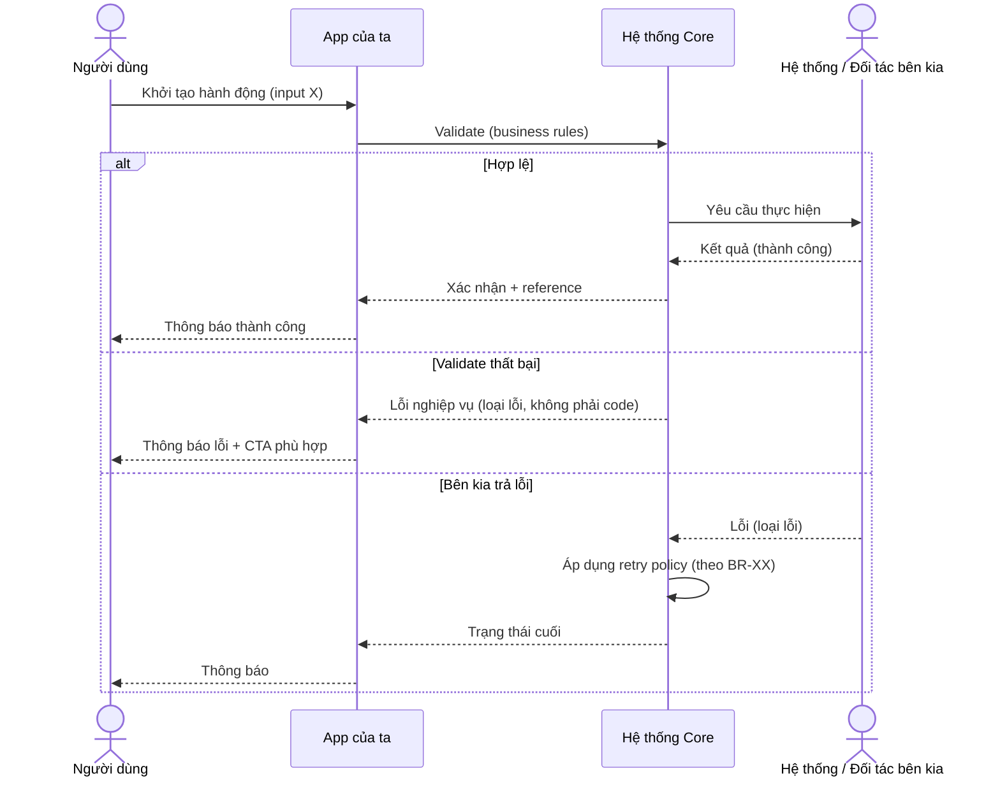
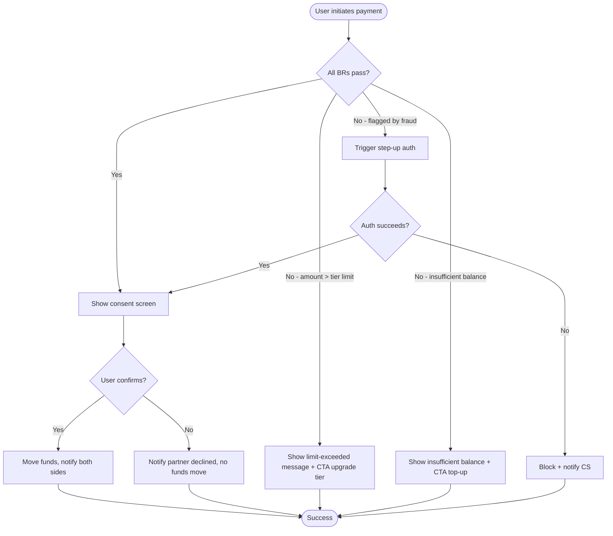
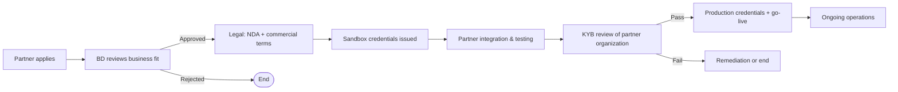

# Annotated Examples & Templates

Read this file when you need concrete patterns for spec writing — section excerpts, Mermaid diagrams, or a complete short spec.

---

## Part 1 — Good vs bad spec excerpts

### Example 1.1 — Context & objective

**Bad:**
> This feature is the partner API. It allows partners to integrate with the platform. The goal is to provide an API.

Problems: tautological, no business framing, no value, no audience clarity.

**Better:**
> **Context.** Our wallet currently supports peer-to-peer transfer only between end users in the app. Recent partnership conversations with three e-commerce platforms have surfaced a recurring ask: their customers should be able to pay merchants directly from their wallet without leaving the merchant's app. This feature opens a partner-facing channel for that use case.
>
> **Objective.** Enable e-commerce partners to initiate payments from a user's wallet on the user's behalf (with their consent), with sufficient business controls to manage risk, support multiple partners over time, and provide reconciliation data for partner finance teams.

Notes: business context, why now, who benefits, what changes after shipping — no implementation hint.

---

### Example 1.2 — Scope

**Bad:**
> In scope: building the API. Out of scope: nothing.

Problems: empty in-scope, empty out-of-scope.

**Better:**
> **In scope:**
> - Payment initiation from partner app, with user consent flow
> - Single-currency (VND) payments only
> - Sandbox and production environments
> - Three partner types in initial release: marketplaces, ride-hailing, food delivery
> - Reconciliation: daily summary export by partner
>
> **Out of scope (this release):**
> - Recurring / subscription payments — phase 2
> - Multi-currency / cross-border — separate compliance review needed
> - Partner-side refund initiation — phase 2, manual via CS in v1
> - Wallet top-up via partner — separate flow
> - Direct partner-to-merchant settlement (we settle through our existing rail)

Notes: explicit out-of-scope saves arguments. Saying "phase 2" instead of "not doing" signals roadmap.

---

### Example 1.3 — Business rules

**Bad (unnumbered, vague):**
> The system enforces limits. There's KYC. Users have to consent. Fraud check happens.

**Better (numbered, specific):**
> - **BR-01 — Per-transaction limit.** A single payment cannot exceed the user's tier's per-transaction limit. Tier limits are defined in BR-04.
> - **BR-02 — Daily cumulative limit.** A user's cumulative same-day partner payments cannot exceed the tier's daily limit (BR-04).
> - **BR-03 — User consent required.** Each payment must be authorized by the user via consent step before funds move. Pre-authorized recurring is out of scope (see Scope).
> - **BR-04 — Tier limits.** *(values are TBD — Risk to confirm before sign-off)*
>
>   | Tier | Per-transaction | Daily | Monthly |
>   |---|---|---|---|
>   | Basic | TBD | TBD | TBD |
>   | Premium | TBD | TBD | TBD |
>
> - **BR-05 — Partner permission scope.** Each partner is provisioned with a permission scope at onboarding. Payment initiation requires the `payment.initiate` scope. Other scopes (refund, balance query) are not granted by default.
> - **BR-06 — Fraud screening.** Each payment is screened. Flagged transactions trigger a user-side step-up authentication before funds move.

Notes: numbered for reference (`see BR-04`), one rule per item, tabular for tier data, "TBD" with owner instead of fake numbers.

---

### Example 1.4 — Acceptance criteria

**Bad (test steps):**
> User opens partner app, taps "pay with wallet", redirects to wallet, types password, taps confirm, sees success.

**Better (observable outcomes, GWT):**
> **AC-PAY-01 — Successful payment from partner app**
> - **Given** the user has a verified active wallet, sufficient balance, and is within their tier limits
> - **And** the partner has the `payment.initiate` permission scope
> - **When** the user consents to the payment via the platform consent flow
> - **Then** the amount is debited from the user's wallet and credited to the partner's settlement account
> - **And** the user receives a notification with the payment reference and partner name
> - **And** the partner receives confirmation with the same reference and a status of "completed"
> - **And** the transaction appears in the user's wallet history and the partner's payment ledger
>
> **AC-PAY-02 — User declines consent**
> - **Given** the partner has initiated a payment request
> - **When** the user explicitly declines on the consent screen
> - **Then** no funds move
> - **And** the partner receives confirmation with status "declined by user" and the same reference
> - **And** the partner can offer the user an alternative payment method without showing an error

Notes: AC describes observable outcomes regardless of UI navigation. No HTTP status codes, no JSON keys, no "redirect" mechanism.

---

## Part 2 — Mermaid templates for common BA flows

Use Mermaid for flows that have ≥3 steps or any branching. Keep at actor + system box level — never draw infrastructure (load balancers, databases, microservices).

### Template 2.1 — Sequence (user-initiated, with happy and alt paths)



Notes: "Loại lỗi" not "error code XYZ" — business level. The `participant` for "Hệ thống Core" is one box, not three microservices.

### Template 2.2 — Flowchart (decision tree)



### Template 2.3 — Partner onboarding flow (Variant B)



Notes: arrows have business meaning. No technical details about credential format, no DB tables.

---

## Part 3 — Canonical "Decisions handed to dev" example

This section appears in spec output when (a) the prompt was framed technically, or (b) the spec implies non-trivial technical choices. It explicitly hands off what BA did NOT decide.

```markdown
## Quyết định chuyển giao dev

Các quyết định kỹ thuật sau được chuyển cho team dev. Vui lòng flag về cho BA nếu phát hiện một quyết định có ảnh hưởng đến business mà cần BA cân nhắc:

**API design**
- Protocol & format (REST/JSON, GraphQL, gRPC) — dev chọn theo industry standard
- Endpoint structure & URL convention
- Request/response schema (cấu trúc field, kiểu dữ liệu, version negotiation)
- Pagination strategy cho list endpoints
- Versioning approach (URL path, header, content negotiation)

**Authentication & authorization**
- Cơ chế xác thực partner (API key, OAuth2 client_credentials, mTLS) — dev/security chọn
- Token lifecycle & rotation policy
- Permission scope encoding

**Reliability & operations**
- Rate limit values per partner tier (within business intent in BR-XX)
- Idempotency mechanism (idempotency-key header / request fingerprint / khác)
- Retry policy implementation (backoff, max attempts) — phải tôn trọng business window trong BR-XX
- Webhook delivery mechanism & retry policy implementation

**Data & storage**
- Database schema, indexing, sharding
- Data encryption at rest detail (algorithm, key management)
- Logging detail level & retention infrastructure (within retention policy BR-XX)

**Errors**
- Specific HTTP status codes / error code structure (within error categories listed in Section X)
- Error message wording for partner-facing responses (within voice guidelines)

Nếu trong quá trình implement, dev gặp quyết định không nằm trong danh sách trên và có vẻ ảnh hưởng business, vui lòng raise sớm — đừng đoán.
```

Notes:
- Grouped by area for readability
- Each item is a TECHNICAL decision dev owns, with implicit constraint (must respect BR-XX) when applicable
- The closing line invites dev to surface unknown unknowns — prevents silent business-impacting choices

---

## Part 4 — Short complete spec example (Variant B excerpt)

This shows what a tight Variant B spec looks like end-to-end. (Body sections only — header and appendix omitted for brevity.)

> # Partner Payment API — Spec
>
> ## Bối cảnh & mục tiêu
> [3-6 sentences as in Example 1.1]
>
> ## Phạm vi
> [bullets as in Example 1.2]
>
> ## Tác nhân
> - **End user** — chủ ví, đã xác thực, có số dư
> - **Partner application** — ứng dụng của đối tác đã được provision, có scope `payment.initiate`
> - **Wallet platform (ta)** — xử lý xác thực user, kiểm tra rule, move tiền, thông báo
> - **Hệ thống fraud** — nội bộ, screen mọi giao dịch
>
> ## Quy tắc nghiệp vụ
> [BR-01 to BR-06 as in Example 1.3]
>
> ## Luồng nghiệp vụ
> [Mermaid sequence from Template 2.1, adapted]
>
> ## Tiêu chí chấp nhận
> [AC-PAY-01, AC-PAY-02 as in Example 1.4, plus 4-6 more covering edges]
>
> ## Onboarding đối tác
> Quy trình business-level cho đối tác mới:
> 1. Đối tác nộp application (form chuẩn)
> 2. BD review business fit (≤ 5 ngày làm việc)
> 3. Legal: NDA + commercial agreement
> 4. Sandbox credentials phát hành; đối tác có 60 ngày để integrate và test
> 5. KYB review tổ chức đối tác (~ 10 ngày làm việc)
> 6. Production go-live
>
> [Mermaid flowchart from Template 2.3]
>
> ## Quyền hạn & quota của đối tác
> | Loại đối tác | Operations được phép | Daily volume tier | Notes |
> |---|---|---|---|
> | Tier 1 (marketplace lớn) | payment.initiate, payment.query, reconciliation.export | TBD | KYB strict |
> | Tier 2 (đối tác trung) | payment.initiate, payment.query | TBD | |
> | Tier 3 (sandbox / dev) | payment.initiate, payment.query (testnet) | thấp | Không thật |
>
> Hạn mức volume cụ thể: Risk team chốt trước go-live.
>
> ## Webhook & callback
> Đối tác đăng ký URL nhận webhook cho các sự kiện:
> - `payment.completed` — sau khi giao dịch hoàn tất thành công
> - `payment.declined_by_user` — user từ chối consent
> - `payment.failed` — giao dịch thất bại (kèm loại lỗi business-level)
>
> Mong đợi giao hàng: best-effort retry trong 24 giờ. Sau 24 giờ, sự kiện được đánh dấu là "expired" trong log của ta; đối tác có thể query trạng thái cuối qua API reconciliation.
>
> ## Reconciliation
> Mỗi ngày, đối tác có thể export danh sách giao dịch ngày hôm trước qua endpoint reconciliation. Định dạng business: từng dòng = một giao dịch với (reference, user identifier đã mask, số tiền, trạng thái cuối, thời điểm).
>
> Đối tác chịu trách nhiệm reconcile với hệ thống của họ. Tranh chấp được xử lý qua quy trình support (T+3 SLA cho tranh chấp).
>
> ## Sandbox vs production
> Sandbox áp dụng cùng business rule với production, chỉ khác:
> - Hạn mức thấp hơn (để partner test mà không cần tiền thật quy mô lớn)
> - Tiền là ảo, không di chuyển thật
> - Fraud screening vẫn chạy (để partner test cả branch flagged)
> - Webhook delivery dùng cùng cơ chế production
>
> ## Phân loại lỗi (partner-facing)
> Đối tác cần phân biệt được các loại lỗi sau (dev chọn mã/message cụ thể):
> - `validation_failed` — input không hợp lệ
> - `insufficient_permission` — partner thiếu scope
> - `user_declined` — user từ chối consent
> - `business_rule_violated` — vi phạm BR (vd quá hạn mức)
> - `rate_limit_exceeded` — quá tải request
> - `internal_unavailable` — hệ thống ta đang lỗi, đối tác có thể retry
>
> ## Yêu cầu phi chức năng
> - **SLA cảm nhận:** user mong đợi phản hồi trong vài giây
> - **Audit:** mọi giao dịch, mọi từ chối, mọi step-up đều log; lưu trữ 10 năm theo regulation
> - **Sensitivity:** dữ liệu giao dịch là financial PII, áp dụng masking/encryption theo policy chung
> - **Compliance:** AML screening cho giao dịch lớn (ngưỡng theo policy compliance hiện hành)
>
> ## Phụ thuộc
> - Hệ thống fraud screening (đã có, cần xác nhận capacity)
> - Hệ thống notification (push + SMS) — đã có
> - Compliance team chốt ngưỡng AML và KYB checklist
> - Risk team chốt giá trị hạn mức tier
> - Legal chốt template hợp đồng đối tác
>
> ## Câu hỏi mở
> - [list của Step 7 — typically forgotten topics]
>
> ## Quyết định chuyển giao dev
> [như Part 3 ở trên]
>
> ## Phụ lục: giả định cần xác nhận
> [bảng theo pattern Step 9]

---

## Quick reference card

When in doubt, check this card before generating output:

- **Boundary check** — would a dev architect look at this section and say "that's my call"? If yes, push it to "Decisions handed to dev"
- **Numbering** — are all business rules numbered for cross-reference?
- **Scope explicitness** — is out-of-scope explicit?
- **Actor level** — flow diagrams have actors and a system box, not infrastructure?
- **AC observability** — does AC describe what someone observes, not what they click?
- **Variant extras** — did you add the variant-specific sections from variants.md?
- **Assumption tracking** — every default value / scope decision / behavior choice on the appendix list?
