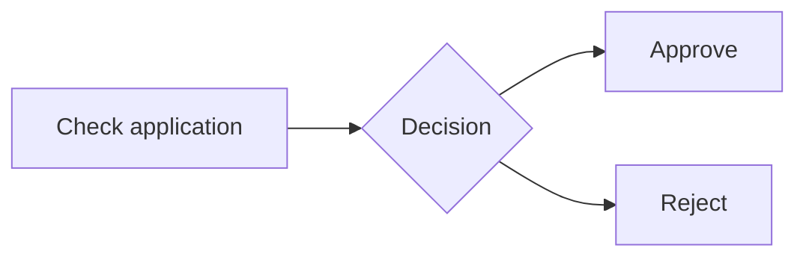
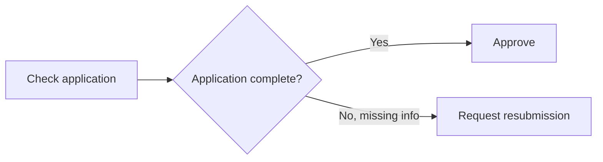
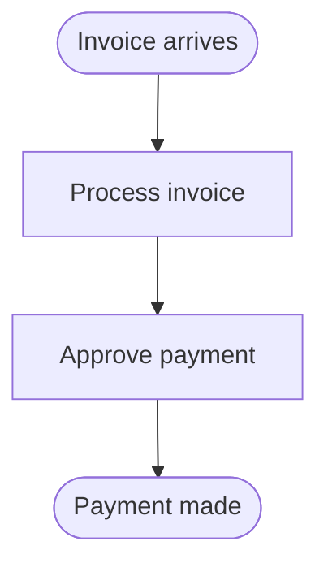
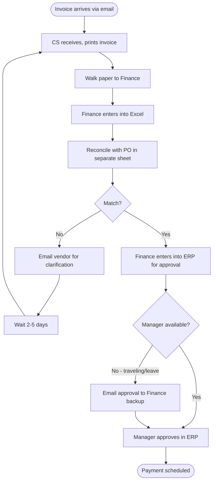

# Annotated Examples — Process Models

## Part 1 — Good vs bad excerpts

### Example 1.1 — Task naming

**Bad:**
```
T1[Verification]
T2[Approval happens here]
T3[The customer gets notified]
T4[/api/notify]
```

Problems: noun-only, passive voice, narrative voice, technical leak.

**Better:**
```
T1[Verify identity]
T2[Approve application]
T3[Notify customer]
T4[Send confirmation email]
```

Notes: every task is verb-object, active voice, business-meaningful.

---

### Example 1.2 — Gateway labeling

**Bad:**


Problems: gateway question is vague ("Decision" — decide what?); outgoing flows unlabeled — reader can't tell which path is which.

**Better:**


Notes: gateway question is specific, flows labeled with outcome condition (not just "Yes" / "No" but explanatory where useful).

---

### Example 1.3 — AS-IS sanitization vs reality

**Sanitized AS-IS (bad):**


Problems: no manual handoffs visible, no decisions, no loops, no exception paths. This tells the reader nothing about why the process is slow or error-prone.

**Honest AS-IS (better):**


Notes:
- Manual handoffs explicit ("walk paper", "email")
- Tool mix visible (paper, Excel, email, ERP)
- Loop on mismatch with wait time
- Exception for unavailable manager
- "Walk paper" task is the kind of detail that points to RPA or e-signature opportunity

This is the AS-IS that drives a useful TO-BE design.

---

### Example 1.4 — Pain points: vague vs specific

**Bad pain points table:**
| Pain | Affected | Impact |
|---|---|---|
| Slow process | Whole flow | High |
| Errors happen | Finance | Medium |
| Hard to track | Everyone | Low |

Problems: no specificity, no numbers, no root cause hypothesis, no link to specific tasks.

**Better pain points table:**
| Pain | Affected task(s) | Frequency | Impact | Root cause (hypothesis) | Source |
|---|---|---|---|---|---|
| Manual data entry from paper to Excel takes ~30 min/invoice × ~50 invoices/day = 25 person-hours/day | T3, T4 | Daily | High — bottleneck causing 3-5 day delays at month-end | Paper-based handoff with no OCR or digital ingestion | confirmed (user data) |
| PO mismatch round-trips with vendor cost 2-5 days per occurrence; ~10% of invoices affected | T5, T6 (loop) | ~10% of invoices | High — direct cause of late payments | Vendor format inconsistency + no automated validation | hypothesis (inferred from loop) |
| Manager unavailability causes secondary approval chain; happens ~2-3 times/week | T9 | 2-3×/week | Medium — adds 1-day delay typically | No delegation policy in ERP | hypothesis |

Notes: numbers (even rough), task references, frequency, marked confirmed vs hypothesis. Each pain is actionable — leadership can prioritize because they see the impact.

---

### Example 1.5 — Gap analysis: phantom changes

**Bad gap analysis** (phantom TO-BE tasks):
| AS-IS task | TO-BE behavior | Change type |
|---|---|---|
| T1: Receive invoice | T1: System receives | Automated |
| T2: Walk paper | (removed) | Eliminated |
| (none) | T-new: Validate via AI | New |
| T3: Enter data | (not addressed) | ??? |

Problems: T3 has no mapping (orphan); "T-new: AI validation" introduced without traceability to a pain or requirement; gap row 4 has unclear status.

**Better gap analysis:**
| AS-IS task ID | TO-BE behavior | Change type | Pain addressed | Risk introduced |
|---|---|---|---|---|
| T1 | System ingests invoice via email parser | Automated | "Manual receive + print" pain | Email parsing edge cases (non-standard formats) — need fallback to manual |
| T2 (walk paper) | — | Eliminated | "Manual handoff" pain | None — physical step had no business value |
| T3 (Excel entry) | System auto-extracts via OCR/parsing | Automated | "30 min/invoice manual entry" pain | OCR errors on non-standard layouts — confidence threshold needed |
| T4-T6 (PO mismatch loop) | System auto-matches with PO; mismatch flagged for human review (T7-new) | Streamlined + new | "2-5 day mismatch round-trips" pain | Edge cases where match logic is wrong — human review for low-confidence cases |
| T7 (ERP entry) | TO-BE T7-new: Human reviews flagged exceptions only | Moved (from default to exception path) | Reduces Finance daily workload | Finance team role shifts from data entry to exception handler — training needed |
| T8-T9 (manager approval) | T8: Approval via ERP with delegated fallback | Streamlined | "Manager unavailable" pain | ERP delegation config drift if not maintained |

Notes: every AS-IS task is accounted for (eliminated, automated, streamlined, moved); each TO-BE addition links to specific AS-IS context; risks surfaced — TO-BE isn't pretended to be strictly better.

---

## Part 2 — Full short example: V-A AS-IS

> # Quy trình xử lý hoàn tiền (AS-IS)
>
> ## Thông tin chung
>
> | Trường | Giá trị |
> |---|---|
> | Variant | V-A — AS-IS only |
> | Variant rationale | User yêu cầu "vẽ quy trình hiện tại"; chưa có yêu cầu thiết kế lại |
> | Process owner | CS Lead |
> | Trigger | Khách hàng yêu cầu hoàn tiền |
> | Outcomes | Hoàn tiền thành công / Yêu cầu bị từ chối / Yêu cầu pending (escalation) |
> | Status | Draft |
>
> ## Tác nhân
> - **Khách hàng** — người yêu cầu hoàn tiền
> - **CS Agent (tier 1)** — tiếp nhận và xử lý yêu cầu đơn giản
> - **CS Lead** — duyệt yêu cầu phức tạp hoặc số tiền lớn
> - **Finance** — thực hiện chuyển khoản hoàn tiền
>
> ## Sơ đồ quy trình (AS-IS)
>
> ```mermaid
> flowchart TD
>   subgraph Customer [Khách hàng]
>     Start([Khách hàng yêu cầu hoàn tiền]) --> T1[Liên hệ qua hotline / email / app]
>   end
>   subgraph CS [CS Agent]
>     T1 --> T2[CS tiếp nhận, tạo ticket]
>     T2 --> T3[Yêu cầu khách cung cấp lý do, mã đơn, ảnh chụp]
>     T3 --> D1{Đầy đủ thông tin?}
>     D1 -->|No| T4[Yêu cầu khách bổ sung]
>     T4 --> T3
>     D1 -->|Yes| D2{Số tiền < 500K và lý do rõ ràng?}
>     D2 -->|Yes - CS tier 1 duyệt được| T5[CS tier 1 duyệt]
>   end
>   subgraph CSLead [CS Lead]
>     D2 -->|No - cần leader| T6[CS Lead review]
>     T6 --> D3{Đồng ý hoàn?}
>     D3 -->|No| T7[Phản hồi từ chối kèm lý do]
>     D3 -->|Yes| T8[CS Lead approve trong hệ thống]
>   end
>   subgraph Finance [Finance]
>     T5 --> T9[Finance nhận yêu cầu duyệt]
>     T8 --> T9
>     T9 --> T10[Finance check số dư + verify lần 2]
>     T10 --> D4{OK chuyển?}
>     D4 -->|Yes| T11[Finance thực hiện chuyển khoản qua banking]
>     D4 -->|No - cần verify thêm| T12["Email lại CS để xác nhận"]
>     T12 --> T6
>     T11 --> T13[Finance đánh dấu hoàn tất trong hệ thống]
>   end
>   subgraph CustomerEnd [Khách hàng]
>     T13 --> End1([Khách nhận tiền])
>     T7 --> End2([Yêu cầu bị từ chối])
>   end
> ```
>
> ## Mô tả tác vụ
>
> | ID | Tác vụ | Tác nhân | Input | Output | Avg duration | Ghi chú |
> |---|---|---|---|---|---|---|
> | T1 | Liên hệ kênh hỗ trợ | Khách | Yêu cầu trong đầu | Ticket sơ khởi | < 5 phút | Khách phải chọn 1 trong 3 kênh; không tự động liên thông |
> | T2 | Tiếp nhận, tạo ticket | CS Agent | Yêu cầu khách | Ticket trong CRM | 5-10 phút | Manual entry; CS phải gõ thông tin khách |
> | T3 | Yêu cầu thông tin chi tiết | CS Agent | Ticket | Thông tin bổ sung | 10-30 phút | Pain: nhiều round-trip qua chat/email |
> | T5 | CS tier 1 duyệt | CS Agent | Yêu cầu hợp lệ | Yêu cầu approved | 5 phút | Chỉ áp dụng giao dịch < 500K |
> | T6 | Review yêu cầu phức tạp | CS Lead | Ticket + thông tin | Quyết định | 30 phút - 2 giờ | Pain: phụ thuộc availability của Lead |
> | T9 | Finance nhận, xử lý | Finance | Approved request | Verified | 1-2 giờ | Pain: Finance check thủ công, không tin tưởng CS |
> | T10 | Verify lần 2 | Finance | Approved request | OK hoặc cần verify thêm | 30 phút | Duplicate work với CS |
> | T11 | Chuyển khoản qua banking | Finance | Verified request | Bank transaction | 10-15 phút | Manual qua banking portal; không auto |
> | T12 | Email back CS | Finance | Yêu cầu verify | Email tới CS Lead | 5 phút + wait | Pain: round-trip CS ↔ Finance |
>
> *(Một số tasks T4, T7, T8, T13 omitted for brevity — đầy đủ trong file)*
>
> ## Điểm đau / vấn đề hiện tại
>
> | Pain | Affected | Frequency | Impact | Root cause (hypothesis) | Source |
> |---|---|---|---|---|---|
> | Round-trip xin thông tin từ khách 2-3 lần trước khi đủ | T3, T4 | ~60% yêu cầu | Cao — kéo dài thời gian từ 1h thành 1-2 ngày | Form yêu cầu không gom thông tin đầy đủ ngay từ đầu | hypothesis |
> | CS Lead bottleneck — chỉ có 1-2 người duyệt; nghỉ phép gây dồn ticket | T6 | Hằng ngày | Cao — yêu cầu pending có thể 1-3 ngày | Không có delegation; không có policy duyệt thay | hypothesis |
> | Finance verify lại trùng với CS, lý do "không tin" | T10 | Mọi yêu cầu | Trung bình — duplicate work, kéo dài 1-2 giờ | Quy trình thiếu data integrity giữa CS và Finance system | hypothesis |
> | Round-trip Finance ↔ CS qua email khi cần verify thêm | T12 | ~15% yêu cầu | Cao — kéo dài 1-2 ngày | Không có communication channel rõ ràng / no SLA | hypothesis |
> | Chuyển khoản thủ công qua banking portal | T11 | Mọi yêu cầu | Trung bình — 15 phút/giao dịch × volume = đáng kể | Không có API banking integration | confirmed (industry pattern) |
>
> ## Câu hỏi mở
>
> - Có policy cụ thể về SLA hoàn tiền không? (luật bảo vệ người tiêu dùng có quy định)
> - Khi CS Lead nghỉ phép có ai backup? (cần xác nhận quy trình)
> - Tỷ lệ refund bị từ chối hiện tại bao nhiêu? (data để đánh giá pain)
> - Loyalty / VIP customer có flow khác không? (chưa rõ trong AS-IS hiện tại)
>
> ## Lưu ý về Mermaid vs BPMN
>
> Mô hình này dùng Mermaid BPMN-flavored — đủ cho discussion và stakeholder review. Nếu cần BPMN formal cho audit hoặc workflow engine (Camunda), migrate sang BPMN tool chuyên dụng.
>
> ## Phụ lục: giả định cần xác nhận
>
> [Standard table format — omitted for brevity]

Notes on this V-A AS-IS:
- ✅ Has exception paths (rejection at D3, verify-back-loop at T12)
- ✅ Has loops (T4→T3, T12→T6)
- ✅ Pain points are specific with task references
- ✅ Each pain marked confirmed vs hypothesis
- ✅ Open questions surface what BA needs to verify
- ✅ Includes Mermaid-vs-BPMN note

---

## Part 3 — Quick reference: when V-A vs V-B vs V-C

| Situation | Variant |
|---|---|
| "Document our current process" | V-A AS-IS |
| "Design the new process after we adopt X" | V-A TO-BE |
| "We want to improve this — compare current and proposed" | V-B |
| "Take this step from the diagram and expand it" | V-C |
| "Map out our customer journey" | V-A (single state, usually AS-IS) |
| "Audit found gaps — redesign" | V-B |
| "Train new hires on the process" | V-A AS-IS (current state) |
| "Decide between two TO-BE options" | Two V-A TO-BE diagrams (one per option), then compare in prose |
