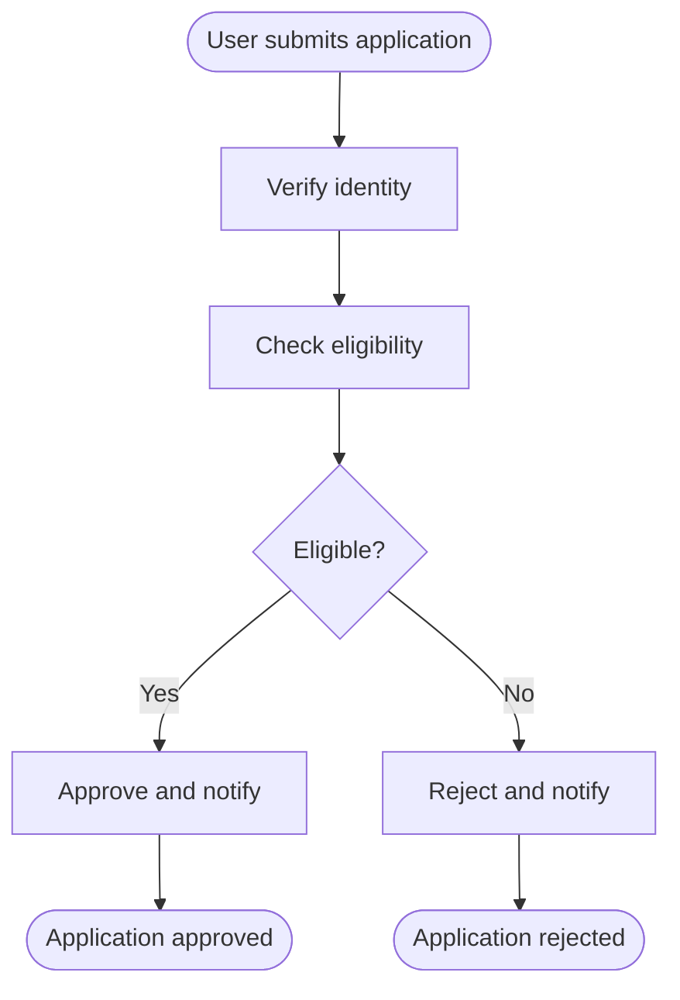
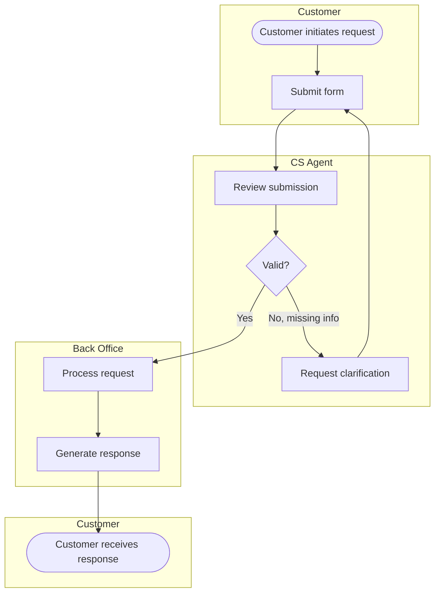
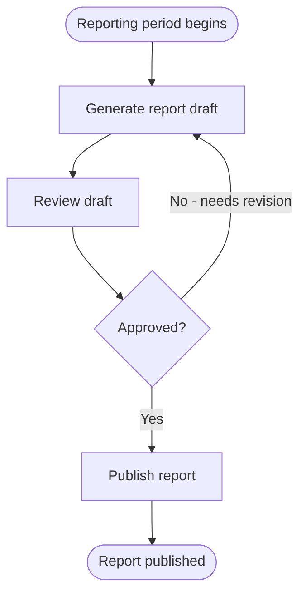
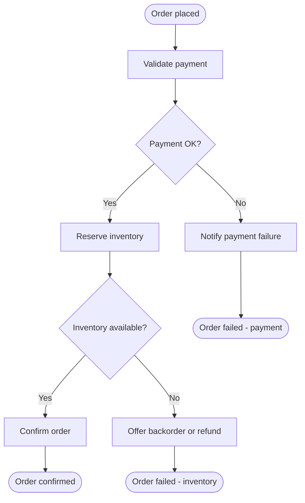
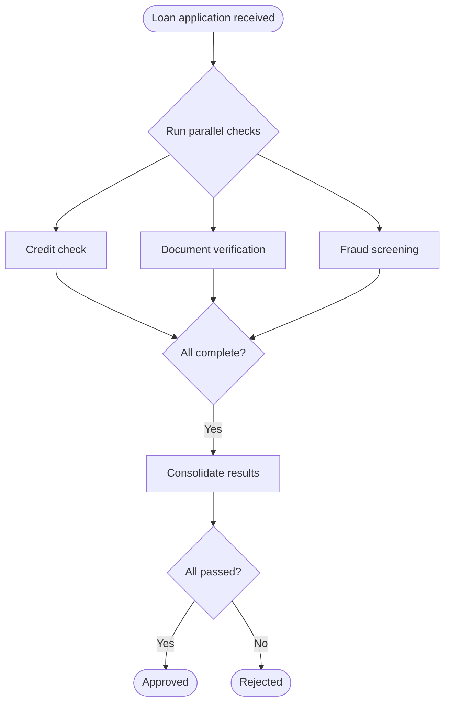
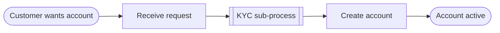
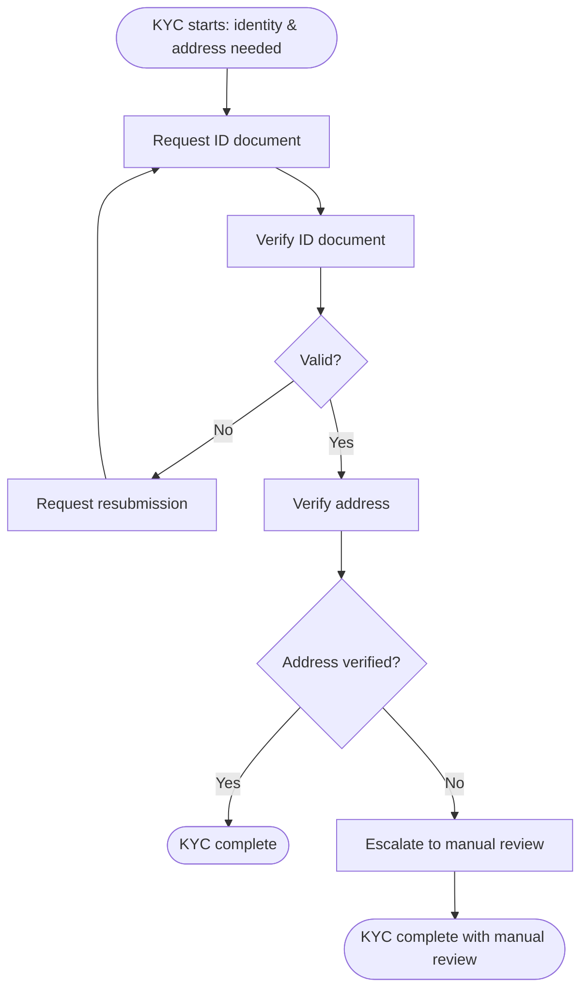
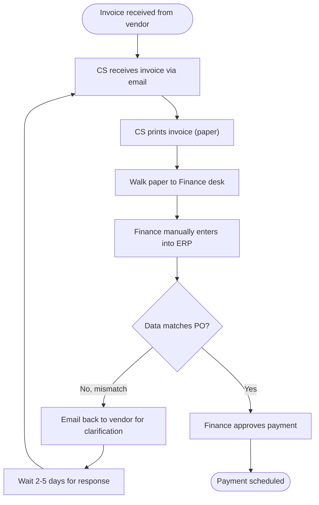

# Mermaid Templates for BPMN-flavored Process Modeling

Seven ready-to-adapt templates covering common BPMN patterns. Copy as starting point, then customize task names and add lanes.

---

## Template 1 — Linear flow with one decision

**Use for:** straight-through processes with a single branch. Simplest pattern.

**Watch out for:** if you have only this, you may be sanitizing reality — most real processes have multiple decisions and exception paths.

---

## Template 2 — Multi-lane with handoffs

**Use for:** any process spanning multiple actors with handoffs.

**Mermaid limitation:** swimlanes via subgraph are visually imperfect (the same actor appearing in two subgraphs renders as two groups). Accept this; it's still readable.

**Watch out for:** every cross-lane arrow is a handoff — explicit handoff steps (email, notification, system push) are often missing in casual mapping.

---

## Template 3 — Loop / iteration

**Use for:** review-and-revise loops, retry patterns, periodic processes, approval cycles.

**Watch out for:** loops with no termination condition are bugs in the model — must have either a max-iteration limit or an alternative path out.

---

## Template 4 — Exception / unhappy path

**Use for:** AS-IS with multiple failure modes, or TO-BE that explicitly handles exceptions.

**Watch out for:** every distinct failure outcome deserves its own end event — collapsing them into a generic "Failed" loses information.

---

## Template 5 — Parallel paths (AND-gateway)

**Use for:** activities that run in parallel and must all complete before the next step.

**Note:** Mermaid doesn't have native AND-gateway (parallel join) — approximate with a question gateway. Annotate clearly with a label.

---

## Template 6 — Sub-process (collapsed)

Parent diagram:

Then zoom into the sub-process as a separate diagram (V-C variant):

**Use for:** breaking down a complex step at parent level, presenting at appropriate detail for audience.

**Watch out for:** sub-process input/output must match parent expectations exactly. If sub-process produces something parent doesn't expect, reconcile.

---

## Template 7 — AS-IS pattern showing pain

**Notes on what makes this AS-IS valuable:**
- Captures manual handoffs ("walk paper")
- Names the tool gaps (email, paper) — not sanitized to "submit document"
- Shows the loop on mismatch (typical pain point: long round-trips)
- Includes a wait task ("Wait 2-5 days") that's invisible work but real elapsed time

**Watch out for:** if your AS-IS looks like Template 1 (clean linear), you're sanitizing. Real AS-IS almost always has loops, manual steps, and exception paths.

---

## Naming & notation conventions (reference card)

| Element | Convention | Examples |
|---|---|---|
| Task | Verb + object | "Verify identity", "Approve refund", "Send notification" |
| Don't use | Noun-only, passive | ~~"Verification"~~, ~~"Refund is approved"~~ |
| Gateway | Short question or criterion | "Approved?", "Amount > 50M?", "In stock?" |
| Don't use | Long sentence, technical | ~~"Check if user.tier >= PREMIUM"~~ |
| Start event | Descriptive trigger | "Application received", "Period begins", "Customer requests refund" |
| Don't use | Bare "Start" | ~~"Start"~~, ~~"Begin"~~ |
| End event | Descriptive outcome | "Order confirmed", "Application rejected", "Payment scheduled" |
| Don't use | Bare "End" | ~~"End"~~, ~~"Done"~~ |
| Lane (subgraph) | Business role name | "CS Agent", "Finance Officer", "Approval Committee" |
| Don't use | Personal name | ~~"Mr. Nguyen"~~, ~~"Mary"~~ |
| Flow from gateway | Always labeled with condition outcome | `D1 -->|Yes\| T2`, `D1 -->|No, missing info\| T3` |
| Don't use | Bare arrow from gateway | ~~`D1 --> T2`~~ |

---

## Mermaid escaping gotchas

- **Parentheses in task names:** wrap in quotes — `T1["CS prints invoice (paper)"]` not `T1[CS prints invoice (paper)]`
- **Special characters** (colons, semicolons, brackets): wrap in quotes
- **Long task names:** Mermaid wraps automatically; use ` ` for explicit line break: `T1["Verify identity (KYC level 2)"]`
- **Multi-line gateway questions:** wrap with quotes and ` `

---

## When NOT to use Mermaid

Migrate to a real BPMN tool when:
- The diagram needs to be executable (Camunda, jBPM)
- Audit / regulatory body requires formal BPMN 2.0 notation
- The process has >20 tasks (Mermaid layout gets messy)
- You need rich annotation (call activities, event sub-processes, compensating tasks)
- Stakeholders are reviewing in a context where BPMN literacy matters

For 80% of BA day-to-day work, Mermaid is sufficient and faster.
