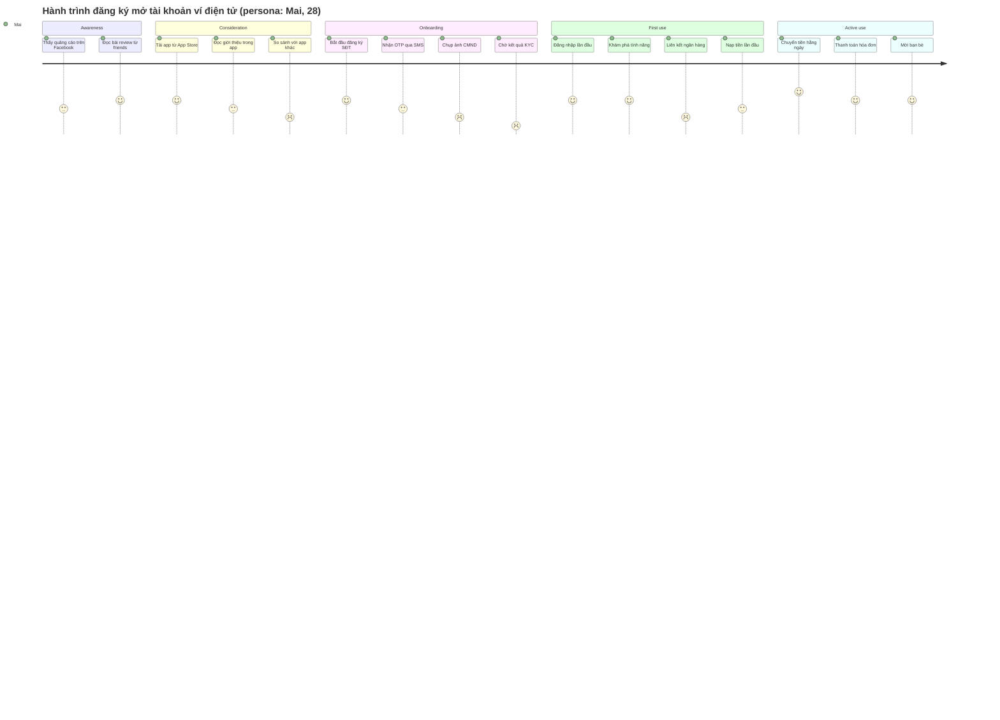
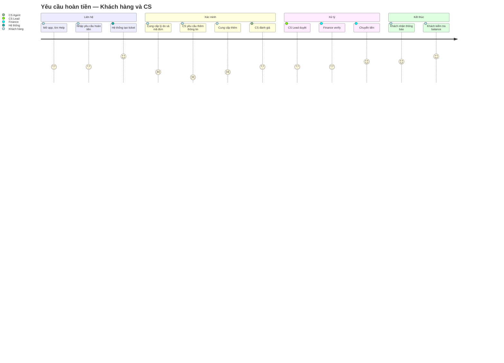

# Mermaid Templates for User Journey Maps

Mermaid hỗ trợ `journey` diagram natively. Đây là templates cho common BA journey patterns.

---

## Template 1 — Basic 5-phase journey

**Notation:**
- Mỗi step có **điểm satisfaction từ 1-5** (1 = rất tệ, 5 = rất tốt)
- Mỗi step có **actor** (sau dấu `:` thứ hai) — thường là persona name
- Phases group bằng `section`

**Use for:** customer journey end-to-end, một persona, satisfaction visible.

---

## Template 2 — Multi-actor journey (customer + system + agent)

**Use for:** journey có multiple actors interacting (customer + agent + system). Mỗi step show actor riêng.

---

## Emotion track approach (supplementary table)

Mermaid journey chỉ show satisfaction 1-5. Để rigorous hơn, kèm bảng emotion track riêng:

| Phase | Touchpoint | Channel | Persona thinks | Persona feels | Pain | Opportunity |
|---|---|---|---|---|---|---|
| Awareness | FB ad | Mobile app | "App này có gì khác?" | Tò mò | Quảng cáo generic, không khác biệt | Personalized ad theo behavior |
| Consideration | Trang giới thiệu | In-app | "Có nên trust không?" | Hoài nghi | Quá nhiều text, không có demo | Video demo 30s đầu trang |
| Onboarding | Chụp CMND | Mobile camera | "Lỡ chụp xấu thì sao?" | Lo lắng | Không có guide overlay, retake nhiều lần | Real-time guidance: "Đặt CMND trong khung" |
| Onboarding | Chờ KYC | Background notification | "Sao lâu thế?" | Sốt ruột | Không biết bao lâu, không có status | Show estimated time + status updates |
| First use | Liên kết ngân hàng | Mobile + bank app | "Quá nhiều bước" | Mệt | OAuth flow phức tạp, switch app nhiều lần | Streamlined linking với 1-tap auth |

**Why supplementary table:** journey diagram visual nhưng limited. Bảng cho phép rich detail per touchpoint — đặc biệt **Opportunity** column.

---

## Opportunity table (derived from journey + emotion)

Sau khi map journey và emotion, consolidate opportunities:

| # | Opportunity | Pain addressed | Phase | Effort | Expected impact |
|---|---|---|---|---|---|
| OPP-01 | Personalized ad theo behavior | Generic ad không break through | Awareness | M | +15% click-through (est.) |
| OPP-02 | Video demo 30s | Hoài nghi do quá nhiều text | Consideration | S | +20% scroll-through to action |
| OPP-03 | Real-time guidance khi chụp CMND | Retake nhiều lần, frustrating | Onboarding | M | -40% drop-off at KYC photo step |
| OPP-04 | KYC status updates với ETA | Sốt ruột khi chờ | Onboarding | S | Reduce support tickets về "KYC bị treo" |
| OPP-05 | Streamlined bank linking 1-tap | Quá nhiều bước, switch app | First use | L | +25% completion of first-link |

---

## Best practices

**Phases consistent granularity:** đừng mix "Awareness" (macro) với "Click Submit" (micro). Phases ở cùng level.

**Persona-driven:** mỗi journey diagram nên focus 1 persona. Multiple personas → multiple diagrams hoặc multiple journey lanes.

**Emotion data source:**
- **From user research:** label "validated"
- **From BA inference:** label "hypothesis — verify via UX research"

Be honest về data source. BA inference có giá trị nhưng audience nên biết tin vào level nào.

**Channel matters:** customer hôm nay omnichannel. Cùng touchpoint có thể happen via mobile app / website / email / branch / call center. Channel column trong table critical.

---

## When NOT to use journey

- Process flow with no customer experience component → V-A process flow, not journey
- Internal back-office workflow (no customer involvement) → V-A
- Just listing screens user sees → V-E UI flow, not journey
- Technical sequence → out of BA scope
