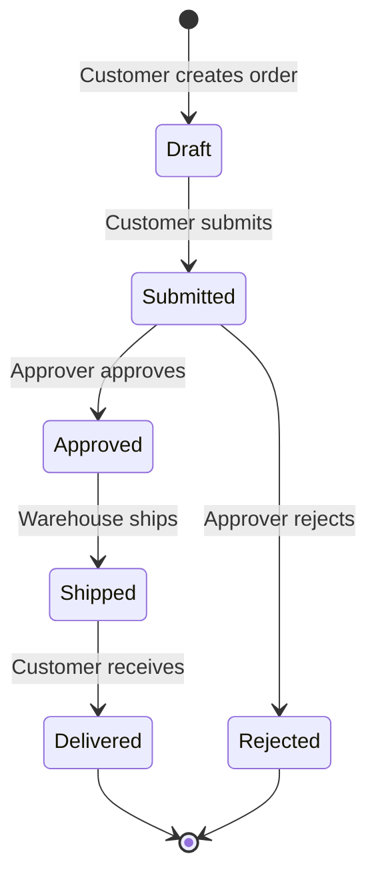
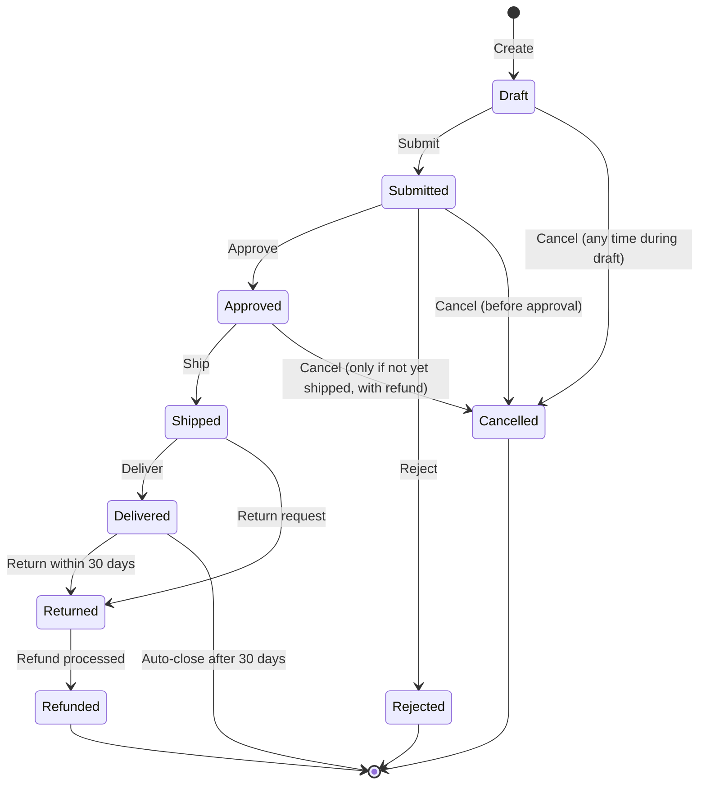
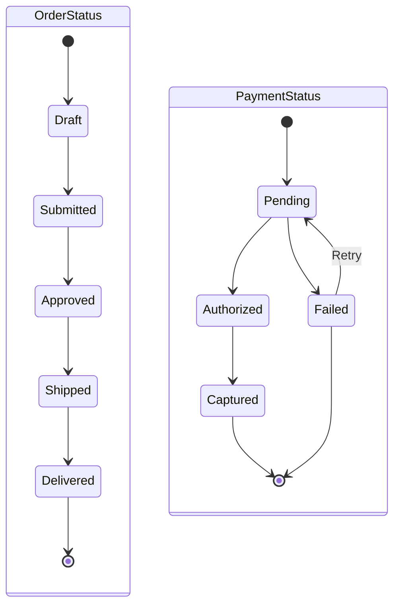
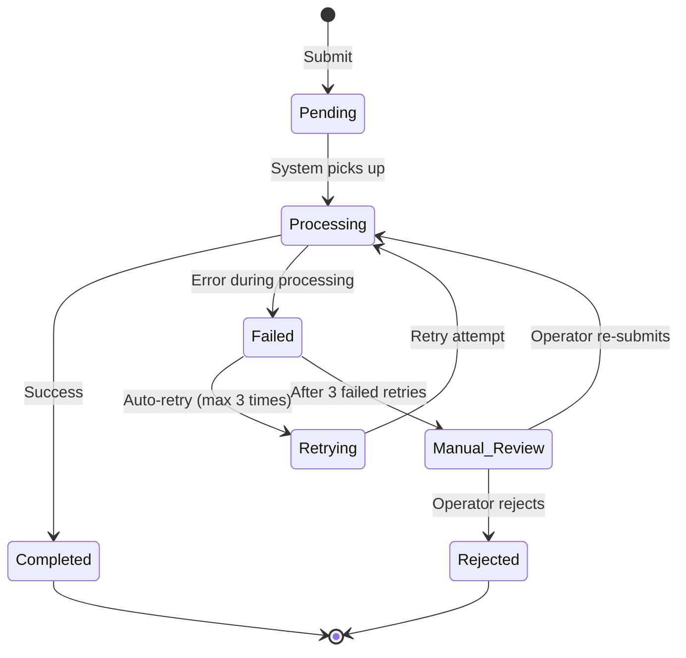

# Mermaid Templates for State Diagrams

Mermaid hỗ trợ `stateDiagram-v2` cho state machines. Templates dưới đây cover common BA state patterns.

---

## Template 1 — Linear lifecycle (Order)

**Notation:**
- `[*]` = initial / terminal pseudo-state (start and end of lifecycle)
- `-->` = transition with trigger (after `:`)
- Each state is a noun (Draft, Submitted), each trigger is a verb-phrase

**Use for:** standard linear lifecycle with branches at decision points.

---

## Template 2 — Cancellation paths (most entities can be cancelled)

**Notes:**
- Multiple paths can lead to terminal state — that's OK
- Same trigger (Cancel) appears in multiple states — but each has different guard conditions in transition table
- Add transition table to document side effects (e.g., "Cancel from Approved triggers refund initiation")

**Use for:** lifecycle with multiple terminal outcomes (Delivered, Refunded, Cancelled, Rejected).

---

## Template 3 — Concurrent state machines (Order with payment state independent)

**Use for:** entity với multiple independent state dimensions (e.g., Order has order_status AND payment_status, both transition independently but related).

**Note:** Mermaid stateDiagram-v2 không native support truly orthogonal regions. Above is approximation — for formal UML state chart, use specialized tool.

---

## Template 4 — Error / exception states

**Notes:**
- Error states (Failed, Retrying, Manual_Review) explicit
- Retry logic visible (max 3 retries before escalation)
- Manual intervention path documented

**Use for:** processes with automated handling + manual fallback (common in fintech, healthcare, regulated workflows).

---

## State table (supplementary)

| State | Description (business meaning) | Entry conditions | Exit conditions | Permitted actions in this state |
|---|---|---|---|---|
| Draft | Customer is composing order, not yet committed | Customer initiates new order | Customer submits OR cancels OR abandons (30-day auto-cleanup) | Add items, remove items, save, submit, cancel |
| Submitted | Order committed by customer, awaiting approval | Customer submits | Approver acts (approve/reject) OR customer cancels before approval | View only (customer can still cancel, cannot modify) |
| Approved | Order approved, awaiting shipping | Approver approves | Warehouse ships OR cancel (with refund logic) | Cancel (with conditions) |
| ... | ... | ... | ... | ... |

---

## Transition table (supplementary)

| From | To | Trigger event | Guard conditions | Side effects (business) |
|---|---|---|---|---|
| Draft | Submitted | Customer clicks Submit | All required fields filled; payment method selected | Submission record created; approver notified; customer email confirmation |
| Submitted | Approved | Approver clicks Approve | Order passes validation; customer not blacklisted | Approval record; inventory reserved; warehouse notified |
| Submitted | Rejected | Approver clicks Reject | Approval reason captured | Rejection record; customer email with reason; payment authorization released |
| Approved | Shipped | Warehouse confirms dispatch | Tracking number assigned | Shipping record; customer notification with tracking |
| Approved | Cancelled | Customer requests cancellation | Not yet picked by warehouse | Refund initiated; inventory released |
| Shipped | Delivered | Carrier confirms delivery | Recipient signature | Delivery record; satisfaction survey triggered |
| Delivered | Returned | Customer requests return | Within 30 days of delivery; reason captured | Return record; return shipping label issued |
| Returned | Refunded | Item received in good condition | Inspection passed | Refund to original payment; customer notified |

---

## Best practices

**State naming:** noun-phrases describing **a condition** entity is IN, not actions ("Submitted" not "Submit"; "Approved" not "Approve").

**Transition naming:** verb-phrases describing the **event triggering** transition ("Customer submits", "Approver approves").

**Initial state explicit:** every state machine has clear `[*] -->` showing where entity starts.

**Terminal states marked:** entities don't transition forever — show `--> [*]` for ends.

**Guards in table, not diagram:** Mermaid stateDiagram-v2 doesn't natively support guard conditions in arrows clearly — use the supplementary transition table.

**Side effects critical:** every state change has business consequences (notifications, records, money movements, inventory). Document in transition table.

**Don't confuse state with status flag:**
- State: exclusive, entity in exactly 1 state at a time (Draft / Submitted / Approved...)
- Status flags: independent booleans (is_paid, is_shipped, is_archived — can all be true simultaneously)

If your "states" can co-exist, you have status flags, not a state machine. Document as data attribute (Skill 5), not state diagram.

---

## When NOT to use state diagram

- Process flow (activities) → V-A process, not state diagram
- One-time workflow without explicit lifecycle → V-A process
- Simple binary status (active/inactive) — overkill, just document as enum attribute in V-A data spec

State diagram earn its place when entity has 4+ states with non-trivial transition logic and guards.
