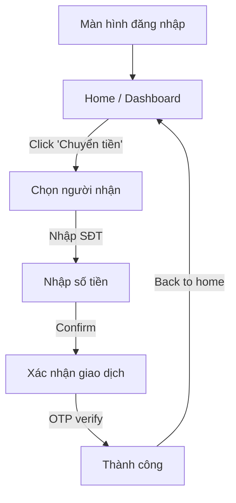
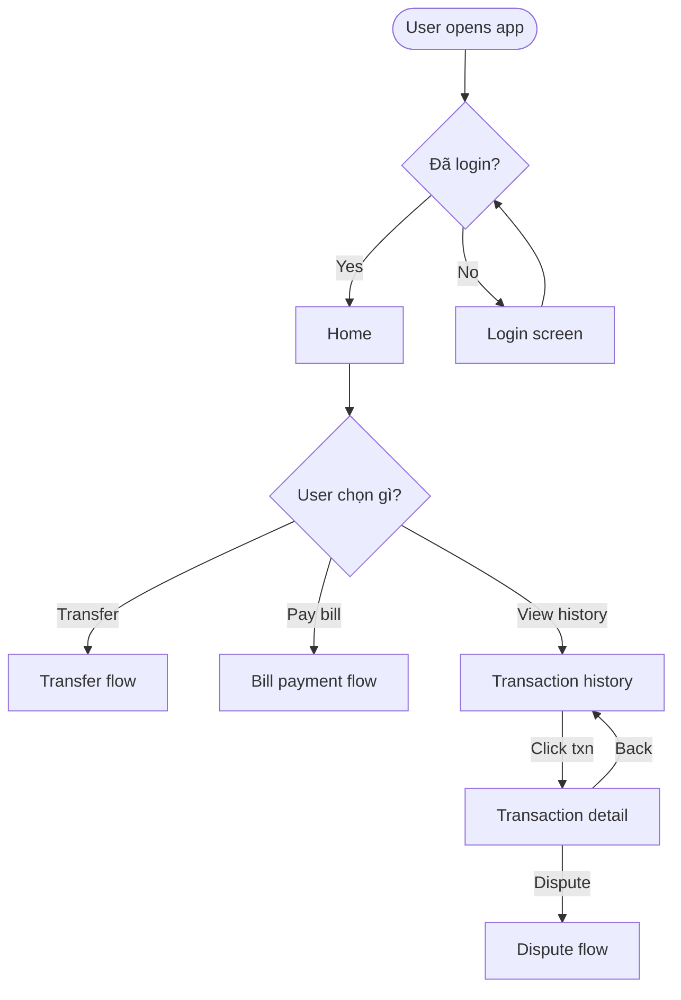
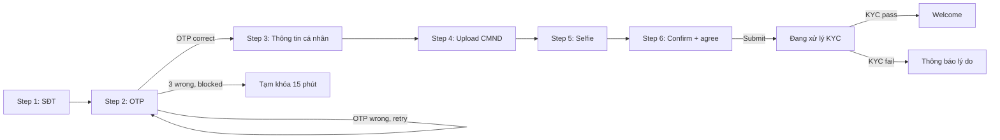

# UI Flow & Screen Description

Templates và format cho V-E (UI flow / screen navigation) và V-F (screen description / fields).

**Important:** này không phải visual wireframe. Skill produce structured navigation + structured field description. Visual mockup → tool ngoài (Figma, Balsamiq, Whimsical).

---

## V-E — UI Flow (screen-to-screen navigation)

### Template 1 — Simple linear flow

**Conventions:**
- Each node is a screen (named clearly)
- Each arrow has a navigation trigger (button click, gesture, automatic)
- Back/cancel paths shown explicitly (or noted "every screen has Cancel returning to home")

### Template 2 — Branching flow with conditional routing

**Use for:** flow với conditional routing dựa trên state hoặc user choice.

### Template 3 — Multi-step form with progress

**Use for:** wizard / multi-step onboarding với retry và terminal states.

### Screen table (supplement to UI flow diagram)

| Screen ID | Name | Entry from | Exit to | Purpose | Notes |
|---|---|---|---|---|---|
| S-01 | Login | App launch | Home (success) / Forgot password | User authentication | Biometric option if enabled |
| S-02 | Home / Dashboard | Login success | Transfer, Bill, History, Profile, Logout | Main navigation hub | Balance visible top; quick actions; recent txn |
| S-03 | Transfer step 1: Recipient | Home (Transfer button) | Step 2 / Back to home | Select recipient by phone/QR/contact | Show recently used recipients |
| S-04 | Transfer step 2: Amount | Step 1 | Step 3 / Back to Step 1 | Enter amount, optional message | Show available balance; limit warning if approaching |
| S-05 | Transfer step 3: Confirmation | Step 2 | OTP screen / Back to Step 2 | Review before commit | Highlight amount, recipient name, fee if any |
| ... | ... | ... | ... | ... | ... |

**Coverage check:** every screen in diagram has row in table; every table row has node in diagram.

---

## V-F — Screen description (fields, actions, validation)

**Critical:** skill explicitly NOT producing visual mockup. Top of output:

> "Đây là structured description cho screen. Cho visual mockup, dùng Figma / Balsamiq / Whimsical. Description này đủ cho UX designer tạo mockup và dev impl logic."

### Format per screen

#### Screen S-01: Login

**Purpose:** User authentication via phone + OTP, or biometric if enabled.

**Entry context:**
- User has app installed
- User not currently logged in
- Optionally: deep link with pre-filled phone number

**Fields:**

| # | Field | Type | Required | Default | Validation | Notes |
|---|---|---|---|---|---|---|
| F-01 | Số điện thoại | Text (phone) | Yes | Pre-filled if from deep link | Vietnamese phone, 10 digits, starts with 0; must be registered | Show formatted with spaces (0901 234 567) |
| F-02 | Mã OTP | Text (6 digits) | Yes (after OTP requested) | Empty | 6 digits, sent via SMS | Auto-focus next field as user types; auto-submit on 6th digit |

**Actions:**

| # | Action | Type | Behavior | Enabled when |
|---|---|---|---|---|
| A-01 | "Gửi OTP" | Primary button | Validates F-01, calls send-OTP, transitions to OTP entry state | F-01 valid |
| A-02 | "Xác nhận" | Primary button | Validates F-02, calls verify-OTP, on success → S-02 Home | F-02 has 6 digits |
| A-03 | "Đăng nhập bằng vân tay/Face ID" | Secondary button | Trigger biometric auth (if enrolled) | Biometric enrolled on device |
| A-04 | "Quên mật khẩu" | Link | Navigate to Password recovery flow | Always |
| A-05 | "Cần hỗ trợ?" | Link (bottom) | Navigate to Help center | Always |

**Empty / error states:**

| State | Display |
|---|---|
| OTP sent | Show "Mã đã gửi đến số XXX. Hết hạn sau 5 phút." Timer countdown. "Gửi lại" button (enabled after 30s) |
| OTP wrong | Inline error "Mã không đúng. Còn N lần thử." Counter visible |
| OTP expired | "Mã đã hết hạn." Re-show A-01 |
| Phone not registered | "Số chưa đăng ký. Bạn muốn đăng ký?" CTA → registration flow |
| Network error | "Mạng không ổn định. Vui lòng thử lại." Retry button |

**Cross-screen state preserved:**
- F-01 phone number preserved when navigating back from OTP entry to phone entry (don't make user re-type)

---

### Screen S-04: Transfer step 2 (Amount)

**Purpose:** User enters transfer amount and optional message after selecting recipient.

**Entry context:**
- Recipient selected in S-03 (recipient name + phone passed forward)
- User's available balance known
- User's daily limit known (remaining today)

**Fields:**

| # | Field | Type | Required | Default | Validation | Notes |
|---|---|---|---|---|---|---|
| F-01 | Recipient (read-only) | Display only | N/A | From S-03 | N/A | Show name partially masked (Nguyễn Văn A***) + phone |
| F-02 | Số tiền | Number (money in VND) | Yes | Empty | Min 1,000 VND, Max = min(available balance, remaining daily limit, per-transaction limit per tier) | Format as user types (1,000,000); show available balance below |
| F-03 | Lời nhắn | Text (optional) | No | Empty | Max 100 characters | Show character counter |

**Actions:**

| # | Action | Type | Behavior | Enabled when |
|---|---|---|---|---|
| A-01 | "Tiếp tục" | Primary button | Validate F-02, navigate to S-05 Confirmation | F-02 valid and within limits |
| A-02 | "Hủy" | Secondary button | Cancel flow, navigate back to Home (S-02) with confirmation dialog | Always |
| A-03 | "Back" | Implicit (header back) | Return to S-03 with state preserved | Always |

**Empty / error states:**

| State | Display |
|---|---|
| Amount = 0 or empty | A-01 disabled |
| Amount < 1,000 VND | Inline error "Số tiền tối thiểu là 1,000 VND" |
| Amount > available balance | Inline error "Số dư không đủ. Bạn có XXX VND" |
| Amount > remaining daily limit | Inline error "Vượt hạn mức ngày. Còn XXX VND cho hôm nay." |
| Amount > per-transaction limit | Inline error "Vượt hạn mức mỗi giao dịch. Giới hạn: XXX VND" |

---

## Best practices

**Field types in business terms:** "Text (phone)", "Number (money in VND)", "Dropdown (from list X)" — NOT VARCHAR(15), NUMERIC, ENUM.

**Validation in business rules:** "Vietnamese phone, 10 digits, starts with 0" — NOT regex `^0[0-9]{9}$`.

**Every action has behavior + enabled-when:** dev shouldn't guess when button enabled.

**Empty / error states explicit:** these are where UX matters most; document.

**Cross-screen state assumptions:** what's preserved across navigations? Don't make user re-type if back.

**Localization:** if multi-language, note which fields need translation (labels, error messages, validation text).

**Accessibility (when applicable):** keyboard navigation order, ARIA labels for screen readers, color-not-only-indicator (e.g., error not just red — also icon + text).

---

## When NOT to use V-E or V-F

- Visual mockup needed → tool ngoài (Figma, Balsamiq)
- Pixel-perfect design → designer's job
- Interaction animation / micro-interactions → UX prototype tool
- User research / usability testing artifacts → UX research

V-E và V-F earn place khi cần document UI flow + screen logic for dev/QA handoff, BEFORE visual design starts.
